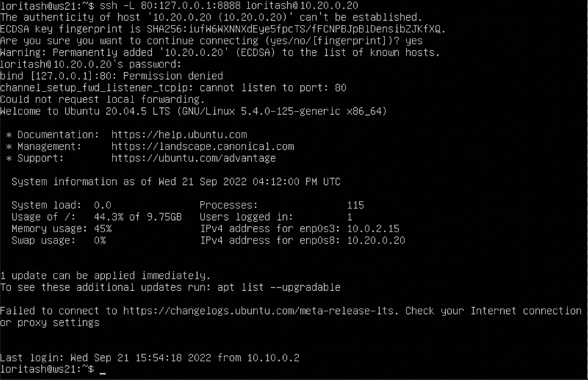

#### 1.1. Сети и маски

##### 1) 

##### 2) ipcalc 192.167.38.54 255.255.255.0
  - 
  
  - 

  - *11111111.11111111.11111111.11110000* в обычную 
  
  -  префиксную 


##### 3) Минимальный и максимальный хост в сети *12.167.38.4* при масках: */8*  
  - *11111111.11111111.00000000.00000000*  
  - *255.255.254.0* 
  - */4* 

#### 1.2. localhost
##### можно ли обратиться к приложению, работающему на localhost, со следующими IP: 
  - *194.34.23.100* - нельзя
  - *127.0.0.2* - можно
  - *127.1.0.1* - можно
  - *128.0.0.1* - нельзя 
  

#### 1.3. Диапазоны и сегменты сетей
##### Определи и запиши в отчёт:
##### 1) Какие из перечисленных IP можно использовать в качестве публичного:
  - *134.43.0.2* 
  - *172.0.2.1* 
  - *192.172.0.1* 
  - *172.68.0.2* 
  - *192.169.168.1* 


  - Какие только в качестве частных: 
  - *10.0.0.45* 
  - *192.168.4.2* 
  - *172.20.250.4* 
  - *172.16.255.255* 
  - *10.10.10.10* 

##### 2) Какие из перечисленных IP адресов шлюза возможны у сети *10.10.0.0/18*: 
 Все возможные шлюзы находятся между значениями HostMin и HostMax:
  - 

  - *10.0.0.1* - нет
  - *10.10.0.2* - да
  - *10.10.10.10* - да
  - *10.10.100.1* - нет 
  - *10.10.1.255* - да


## Part 2. Статическая маршрутизация между двумя машинами

`-` Теперь разберёмся, как связать две машины, используя статическую маршрутизацию.

**== Задание ==**

##### Подними две виртуальные машины (далее -- ws1 и ws2).

##### С помощью команды `ip a` посмотри существующие сетевые интерфейсы.
- ws1 
- ws2 

##### Опиши сетевой интерфейс, соответствующий внутренней сети, на обеих машинах и задать следующие адреса и маски: ws1 - *192.168.100.10*, маска */16*, ws2 - *172.24.116.8*, маска */12*.
- *etc/netplan/00-installer-config.yaml* ws1: 
- ws2 

##### Выполни команду `netplan apply` для перезапуска сервиса сети.
 

#### 2.1. Добавление статического маршрута вручную
##### Добавляем статический маршрут от одной машины до другой и обратно при помощи команды `ip r add`.
  - ws1:
  - 
  - 

  - ws2:
  - 
  - 

#### 2.2. Добавление статического маршрута с сохранением
##### Перезапусти машины.
- Cкрин с содержанием изменённого файла *etc/netplan/00-installer-config.yaml*. 
  - ws1 

  - ws2 


##### Пропингуй соединение между машинами.
- Cкрин с вызовом и выводом использованной команды.
  - ws1 

  - ws2 

## Part 3. Утилита **iperf3**

#### 3.1. Скорость соединения
##### Переведи и запиши в отчёт: 8 Mbps в MB/s, 100 MB/s в Kbps, 1 Gbps в Mbps.
  - 1 мегабит (Mb) = 1/8 мегабайта (MB)
  - 8 мегабит в секунду (Mbps) = 8 / 8 = 1 мегабайт в секунду (MB/s)

  - 1 мегабайт (MB) = 8 мегабит (Mb)
  - 1 мегабит (Mb) = 1000 килобит (Kb)
  - 100 мегабайт в секунду (MB/s) = 100 * 8 * 1000 = 800000 килобит в секунду (Kbps)

  - 1 гигабит (Gb) = 1000 мегабит (Mb)
  - 1 гигабит в секунду (Gbps) = 1000 мегабит в секунду (Mbps)

#### 3.2. Утилита **iperf3**
##### Измерь скорость соединения между ws1 и ws2.
  - Устанавливаем утилиту iperf3 командой sudo apt install iperf3 на обе машины.
  - На ws1 запускаем iperf3 в режиме сервера: iperf3 -s
  - На клиенте (ws2) запускаем iperf3 с указанием IP сервера к которому подключаемся iperf3 -c 192.168.120.100 -R, где
  - -с — адрес сервера с запущенным iperf3 на 5201 порту
  - -R — режим Reverse Mode для тестирования входящей скорости

  - ws1: 
   
  - ws2: 

## Part 4. Сетевой экран

**== Задание ==**

*В данном задании используются виртуальные машины ws1 и ws2 из Части 2*

#### 4.1. Утилита **iptables**
##### Создай файл */etc/firewall.sh*, имитирующий фаерволл, на ws1 и ws2:
```shell
#!/bin/sh

# Удаление всех правил в таблице «filter» (по-умолчанию).
iptables -F
iptables -X
```
##### Нужно добавить в файл подряд следующие правила:
##### 1) На ws1 примени стратегию, когда в начале пишется запрещающее правило, а в конце пишется разрешающее правило (это касается пунктов 4 и 5).
##### 2) На ws2 примени стратегию, когда в начале пишется разрешающее правило, а в конце пишется запрещающее правило (это касается пунктов 4 и 5).
##### 3) Открой на машинах доступ для порта 22 (ssh) и порта 80 (http).
##### 4) Запрети *echo reply* (машина не должна «пинговаться», т.е. должна быть блокировка на OUTPUT).
##### 5) Разреши *echo reply* (машина должна «пинговаться»).
##### Запусти файлы на обеих машинах командами `chmod +x /etc/firewall.sh` и `/etc/firewall.sh`.
- В отчёт помести скрины с запуском обоих файлов;


- На ws1 в начале скрипта пакеты блокируются, но в конце разрешаются, что делает систему доступной для пинга, а в ws2 в начале скрипта есть разрешение на передачу пакетов которое блокируется в конце, что делает систему недоступной для пинга.

#### 4.2. Утилита **nmap**
##### Командой **ping** найди машину, которая не «пингуется», после чего утилитой **nmap** покажи, что хост машины запущен.
*Проверка: в выводе nmap должно быть сказано: `Host is up`*.
- В отчёт помести скрины с вызовом и выводом использованных команд **ping** и **nmap**.


##### Сохрани дампы образов виртуальных машин
**P.S. Ни в коем случае не сохраняй дампы в гит!**


## Part 5. Статическая маршрутизация сети

`-` Пока что мы соединяли всего две машины, но теперь пришло время для статической маршрутизации целой сети.

**== Задание ==**

Сеть: \


##### Подними пять виртуальных машин (3 рабочие станции (ws11, ws21, ws22) и 2 роутера (r1, r2)).


#### 5.1. Настройка адресов машин

##### Настрой конфигурации машин в *etc/netplan/00-installer-config.yaml* согласно сети на рисунке.
- В отчёт помести скрины с содержанием файла *etc/netplan/00-installer-config.yaml* для каждой машины.
##### Перезапусти сервис сети. Если ошибок нет, то командой `ip -4 a` проверь, что адрес машины задан верно. Также пропингуй ws22 с ws21. Аналогично пропингуй r1 с ws11.
- В отчёт помести скрины с вызовом и выводом использованных команд.
  - Открываем sudo nano /etc/netplan/*.yaml

  ws11: 

  ws21: 

  ws22: 

  r1: 

  r2: 

Применяем изменения 'sudo netplan apply' и пробуем пинговать:

  - ping ws22 с ws21:
   

 - ping r1 с ws11:
   


#### 5.2. Включение переадресации IP-адресов
##### Для включения переадресации IP, выполни команду на роутерах:
`sysctl -w net.ipv4.ip_forward=1`
*При таком подходе переадресация не будет работать после перезагрузки системы.*
- В отчёт помести скрин с вызовом и выводом использованной команды.

  - r1:
    

  - r2:
    

##### Открой файл */etc/sysctl.conf* и добавь в него следующую строку:
`net.ipv4.ip_forward = 1`
*При использовании этого подхода, IP-переадресация включена на постоянной основе.*
- В отчёт помести скрин с содержанием  изменённого файла */etc/sysctl.conf*.

  - r1:
    

  - r2:
    

  - Применяем настройки sudo sysctl -p и выполняем команду sysctl net.ipv4.ip_forward для проверки:

  - r1:
    

  - r2:
    

#### 5.3. Установка маршрута по-умолчанию
Пример вывода команды `ip r` после добавления шлюза:
```
default via 10.10.0.1 dev eth0
10.10.0.0/18 dev eth0 proto kernel scope link src 10.10.0.2
```
##### Настрой маршрут по-умолчанию (шлюз) для рабочих станций.

ws11


ws21


ws22


##### Вызови `ip r` и покажи, что добавился маршрут в таблицу маршрутизации.


##### Пропингуй с ws11 роутер r2 и покажи на r2, что пинг доходит. Для этого используй команду:
`tcpdump -tn -i eth0`


#### 5.4. Добавление статических маршрутов
##### Добавь в роутеры r1 и r2 статические маршруты в файле конфигураций. Пример для r1 маршрута в сетку 10.20.0.0/26:
```shell
# Добавь в конец описания сетевого интерфейса eth1:
- to: 10.20.0.0
  via: 10.100.0.12
```


##### Вызови `ip r` и покажи таблицы с маршрутами на обоих роутерах.


##### Запусти команды на ws11:
`ip r list 10.10.0.0/[маска сети]` и `ip r list 0.0.0.0/0`


- Отправка в сеть пакетов с машины ws11 будет через enp0s3 напрямую получателю. При отправке пакетов вне сети 10.10.0.0/18, пакеты будут отправляться на интерфейс шлюза.

#### 5.5. Построение списка маршрутизаторов
##### Запусти на r1 команду дампа:
`tcpdump -tnv -i eth0`
##### При помощи утилиты **traceroute** построй список маршрутизаторов на пути от ws11 до ws21.


 Для определения промежуточных маршрутизаторов traceroute отправляет целевому узлу серию ICMP-пакетов (по умолчанию 3 пакета), с каждым шагом увеличивая значение поля TTL («время жизни») на 1. Это поле обычно указывает максимальное количество маршрутизаторов, которое может быть пройдено пакетом. Первая серия пакетов отправляется с TTL, равным 1, и поэтому первый же маршрутизатор возвращает обратно ICMP-сообщение «time exceeded in transit», указывающее на невозможность доставки данных. Traceroute фиксирует адрес маршрутизатора, а также время между отправкой пакета и получением ответа (эти сведения выводятся на монитор компьютера). Затем traceroute повторяет отправку серии пакетов, но уже с TTL, равным 2, что заставляет первый маршрутизатор уменьшить TTL пакетов на единицу и направить их ко второму маршрутизатору. Второй маршрутизатор, получив пакеты с TTL=1, так же возвращает «time exceeded in transit».
        - Процесс повторяется до тех пор, пока пакет не достигнет целевого узла. При получении ответа от этого узла процесс трассировки считается завершённым.
        - На оконечном хосте IP-датаграмма с TTL = 1 не отбрасывается и не вызывает ICMP-сообщения типа срок истёк, а должна быть отдана приложению. Достижение пункта назначения определяется следующим образом: отсылаемые traceroute датаграммы содержат UDP-пакет с заведомо неиспользуемым номером порта на адресуемом хосте. Номер порта будет равен 33434 + (максимальное количество транзитных участков до узла) — 1. В пункте назначения UDP-модуль, получая подобные датаграммы, возвращает ICMP-сообщения об ошибке «порт недоступен». Таким образом, чтобы узнать о завершении работы, программе traceroute достаточно обнаружить, что поступило ICMP-сообщение об ошибке этого типа.

#### 5.6. Использование протокола **ICMP** при маршрутизации
##### Запусти на r1 перехват сетевого трафика, проходящего через eth0 с помощью команды:
`tcpdump -n -i eth0 icmp`
##### Пропингуй с ws11 несуществующий IP (например, *10.30.0.111*) с помощью команды:
`ping -c 1 10.30.0.111`


## Part 6. Динамическая настройка IP с помощью **DHCP**
##### Для r2 настрой в файле */etc/dhcp/dhcpd.conf* конфигурацию службы **DHCP**:
##### 1) Укажи адрес маршрутизатора по-умолчанию, DNS-сервер и адрес внутренней сети. Пример файла для r2:
```shell
subnet 10.100.0.0 netmask 255.255.0.0 {}

subnet 10.20.0.0 netmask 255.255.255.192
{
    range 10.20.0.2 10.20.0.50;
    option routers 10.20.0.1;
    option domain-name-servers 10.20.0.1;
}
```
##### 2) В файле *resolv.conf* пропиши `nameserver 8.8.8.8`.


##### Перезагрузи службу **DHCP** командой `systemctl restart isc-dhcp-server`. Машину ws21 перезагрузи при помощи `reboot` и через `ip a` покажи, что она получила адрес. Также пропингуй ws22 с ws21.


##### Укажи MAC адрес у ws11, для этого в *etc/netplan/00-installer-config.yaml* надо добавить строки: `macaddress: 10:10:10:10:10:BA`, `dhcp4: true`.


##### Для r1 настрой аналогично r2, но сделай выдачу адресов с жесткой привязкой к MAC-адресу (ws11). Проведи аналогичные тесты.


##### Запроси с ws21 обновление ip адреса.


- Использованные опции: Список шлюзов IP адресов по умолчанию, имя DNS сервера по умолчанию, имя хоста клиента, маска подсети, шлюз по умолчанию. 


## Part 7. **NAT**
`-` Ну и в конце в качестве вишенки на торте я расскажу тебе про механизм преобразования адресов.

**== Задание 7.1-7.3 ==**
##### Добавить в фаервол, созданный по аналогии с фаерволом из Части 4, на r2 следующие правила:
##### 1) Удаление правил в таблице filter - `iptables -F`
##### 2) Удаление правил в таблице "NAT" - `iptables -F -t nat`
##### 3) Отбрасывать все маршрутизируемые пакеты - `iptables --policy FORWARD DROP`
##### Запускать файл также, как в Части 4
##### Проверить соединение между ws22 и r1 командой `ping`
*При запуске файла с этими правилами, ws22 не должна "пинговаться" с r1*
- В отчёт поместить скрины с вызовом и выводом использованной команды.


* Создаем на r2 файл /etc/firewall.sh, имитирующий фаерволл
* Добавляем в фаервол следующие правила:<br>
`iptables -F`<br>
`iptables -F -t nat`<br>
`iptables --policy FORWARD DROP`<br>
<br>*r2*<br>
* Запускаем файл командами `sudo chmod +x /etc/firewall.sh` и `sudo bash /etc/firewall.sh`
<br>*r2*<br>
* Проверяем соединение между ws22 и r1 командой `ping`, ws22 не должна "пинговаться" с r1
<br>*r1*<br>
<br>

**== Задание 7.4 ==**

##### Добавить в файл ещё одно правило:
##### 4) Разрешить маршрутизацию всех пакетов протокола **ICMP**
##### Запускать файл также, как в Части 4
##### Проверить соединение между ws22 и r1 командой `ping`
*При запуске файла с этими правилами, ws22 должна "пинговаться" с r1*
- В отчёт поместить скрины с вызовом и выводом использованной команды.


* Добавляем в фаервол следующие правила:<br>
`iptables -A INPUT -p icmp --icmp-type 8 -j ACCEPT`<br>
`iptables -A OUTPUT -p icmp --icmp-type 8 -j ACCEPT`<br>
<br>*r2*<br>
* Запускаем файл командами `sudo chmod +x /etc/firewall.sh` и `sudo bash /etc/firewall.sh`
<br>*r2*<br>
* Проверяем соединение между ws22 и r1 командой `ping`, ws22 должна "пинговаться" с r1
<br>*r1*<br>

<br>

**== Задание 7.5-7.6 ==**

##### Добавить в файл ещё два правила:
##### 5) Включить **SNAT**, а именно маскирование всех локальных ip из локальной сети, находящейся за r2 (по обозначениям из Части 5 - сеть 10.20.0.0)
##### 6) Включить **DNAT** на 8080 порт машины r2 и добавить к веб-серверу Apache, запущенному на ws22, доступ извне сети
- В отчёт поместить скрин с содержанием изменённого файла.
##### Запускать файл также, как в Части 4
*Перед тестированием рекомендуется отключить сетевой интерфейс **NAT** (его наличие можно проверить командой `ip a`) в VirtualBox, если он включен*
##### Проверить соединение по TCP для **SNAT**, для этого с ws22 подключиться к серверу Apache на r1 командой:
`telnet [адрес] [порт]`
##### Проверить соединение по TCP для **DNAT**, для этого с r1 подключиться к серверу Apache на ws22 командой `telnet`
- В отчёт поместить скрины с вызовом и выводом использованных команд.
##### Сохранить дампы образов виртуальных машин

* Добавляем в фаервол следующие правила:<br>
<br>*r2*<br>
* Отключаем сетевой интерфейс **NAT**
* Запускаем файл командами `sudo chmod +x /etc/firewall.sh` и `sudo bash /etc/firewall.sh`
<br>*r2*<br>
* Проверить соединение по TCP для **SNAT**, для этого с ws22 подключаемся к серверу Apache на r1 командой:
`telnet 10.10.0.1 80`
<br>*ws22*<br>
* Проверяем соединение по TCP для **DNAT**, для этого с r1 подключаемся к серверу Apache на ws22 командой `telnet 10.20.0.20 80`
<br>*r1*<br>
<br>

## Part 8. Дополнительно. Знакомство с **SSH Tunnels**

**== Задание ==**

##### Запустить на r2 фаервол с правилами из Части 7
##### Запустить веб-сервер **Apache** на ws22 только на localhost (то есть в файле */etc/apache2/ports.conf* изменить строку `Listen 80` на `Listen localhost:80`)
##### Воспользоваться *Local TCP forwarding* с ws21 до ws22, чтобы получить доступ к веб-серверу на ws22 с ws21
##### Воспользоваться *Remote TCP forwarding* c ws11 до ws22, чтобы получить доступ к веб-серверу на ws22 с ws11
##### Для проверки, сработало ли подключение в обоих предыдущих пунктах, перейдите во второй терминал (например, клавишами Alt + F2) и выполните команду:
`telnet 127.0.0.1 [локальный порт]`
- В отчёте описать команды, необходимые для выполнения этих четырёх пунктов, а также приложить скриншоты с их вызовом и выводом.
##### Сохранить дампы образов виртуальных машин

* Запускаем на r2 фаервол с правилами из Части 7:<br>
<br>*r2*<br>
* Запускаем файл командами `sudo chmod +x /etc/firewall.sh` и `sudo bash /etc/firewall.sh`
<br>*r2*<br>
* Запускаем веб-сервер **Apache** на ws22 только на localhost (то есть в файле */etc/apache2/ports.conf* меняем строку `Listen 80` на `Listen localhost:80`
<br>*ws22*<br>
* Воспользуемся *Local TCP forwarding* с ws21 до ws22, чтобы получить доступ к веб-серверу на ws22 с ws21
<br>*ws21*<br>
* Воспользуемся *Remote TCP forwarding* c ws11 до ws22, чтобы получить доступ к веб-серверу на ws22 с ws11
<br>*ws11*<br>

<br>
