## Part 1. Инструмент ipcalc

### 1.1 Сети и маски

1) Адрес сети 192.167.38.54/13

      ipcalc 192.167.38.54/13

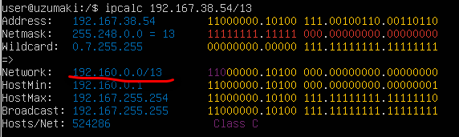

2) Перевод маски 255.255.255.0 в префиксную и двоичную запись

      ipcalc 192.167.38.54 255.255.255.0


   /15 в обычную и двоичную
      ipcalc 192.167.38.54/15

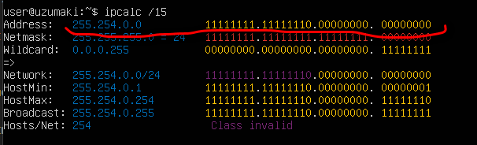

   11111111.11111111.11111111.11110000 в обычную и префиксную
      ipcalc /28


3) Минимальный и максимальный хост в сети 12.167.38.4 при масках: /8

      ipcalc 12.167.38.4/8

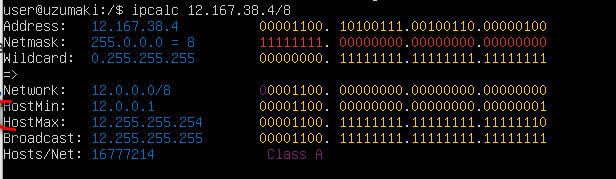

   11111111.11111111.00000000.00000000
      ipcalc 12.167.38.4/16

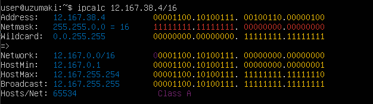

    255.255.254.0 
      ipcalc 12.167.38.4 255.255.254.0 

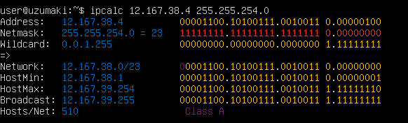

   /4
      ipcalc 12.167.38.4/4

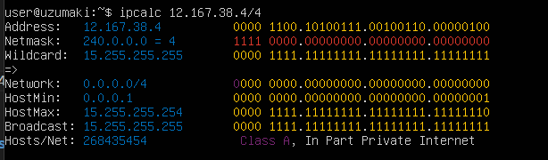

### 1.2 localhost

Определи и запиши в отчёт, можно ли обратиться к приложению, работающему на localhost, со следующими IP: 194.34.23.100

194.34.23.100 - не localhost


127.0.0.2 - localhost

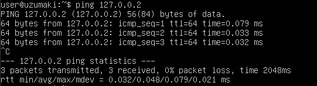

127.1.0.1 - localhost

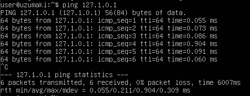

128.0.0.1 - не localhost


### 1.3. Диапазоны и сегменты сетей

Какие из перечисленных IP можно использовать в качестве публичного, а какие только в качестве частныx : 
10.0.0.45, 134.43.0.2, 192.168.4.2, 172.20.250.4, 172.0.2.1, 192.172.0.1, 172.68.0.2, 172.16.255.255, 10.10.10.10,
 192.169.168.1

Публичные сети:

   134.43.0.2
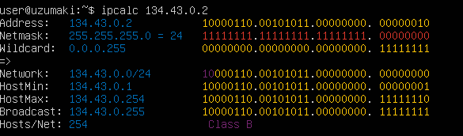

   172.0.2.1
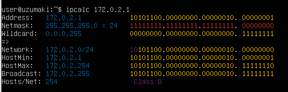

   192.172.0.1
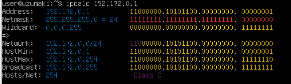

   172.68.0.2
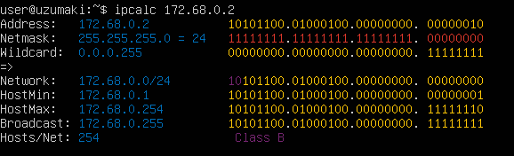

   192.169.168.1
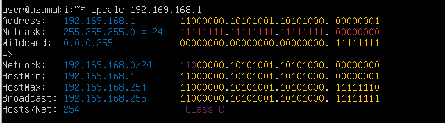

Частные сети: 

   10.0.0.45
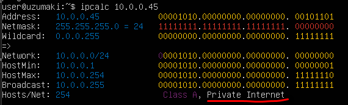

   192.168.4.2
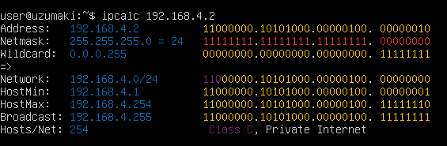

   172.20.250.4
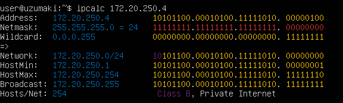

   172.16.255.255
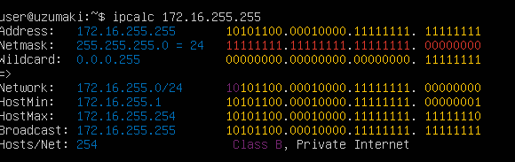

   10.10.10.10
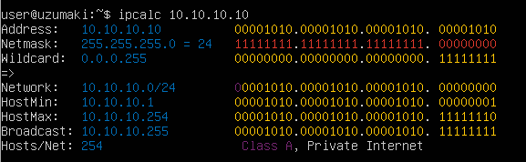


2) Какие из перечисленных IP адресов шлюза возможны у сети 10.10.0.0/18: 10.0.0.1, 10.0.0.1, 10.10.10.10, 10.10.100.1, 
10.10.1.255

   ip calc 10.10.0.0/18
   Возможные шлюзы находятся между значениями HostMin и HostMax:
   10.0.0.1      нет
   10.10.0.2     да
   10.10.10.10   да
   10.10.100.1   нет
   10.10.1.255   да


## Part 2. Статическая маршрутизация между двумя машинами

С помощью команды ip a посмотри существующие сетевые интерфейсы:

   wsl 1: lo и enp0s3

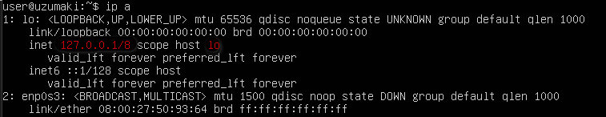

   wsl 2: lo и enp0s3

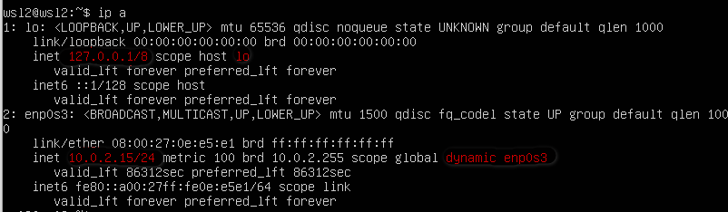

Опиши сетевой интерфейс, соответствующий внутренней сети, на обеих машинах и задать следующие адреса и маски: 

ws1 - 192.168.100.10, маска /16, 

 nano /etc/netplan/*.yaml

 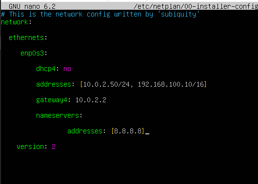


 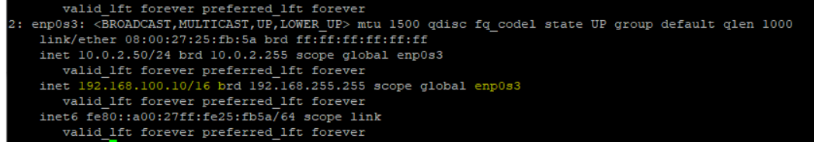

 ws2 - 172.24.116.8, mask /12

  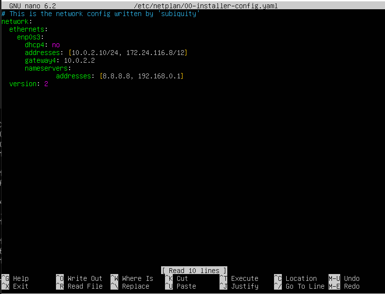


 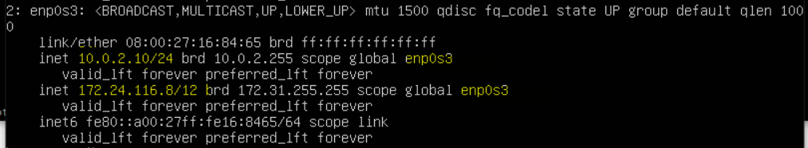

Выполни команду `netplan apply` для перезапуска сервиса сети:

wsl 1:

 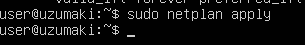

 wsl 2:

  

#### 2.1. Добавление статического маршрута вручную

wsl 2:
   sudo ip route add 192.168.0.0/16 via 10.0.2.50
 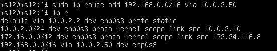

  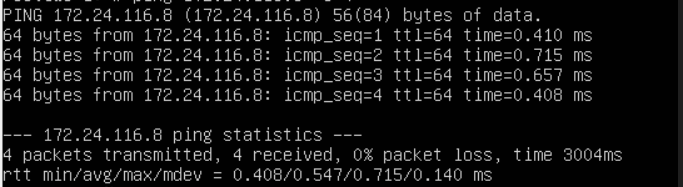
      
wsl 1:
   ip route add 172.16.0.0/12 via 10.0.2.10
 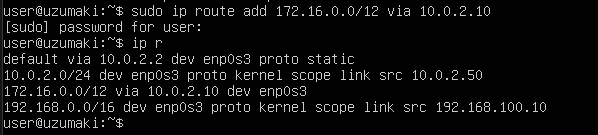

 

#### 2.2. Добавление статического маршрута с сохранением

Добавь статический маршрут от одной машины до другой с помощью файла *etc/netplan/00-installer-config.yaml*.

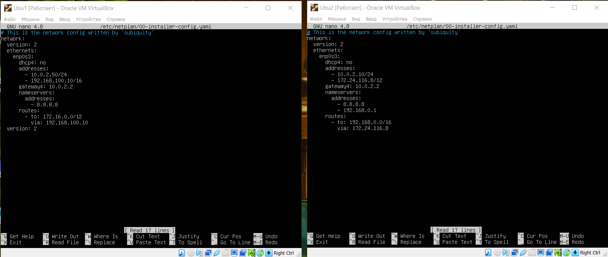

Пропингуй соединение между машинами.

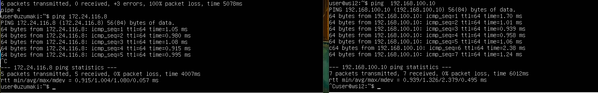


## Part 3. Утилита **iperf3**
#### 3.1. Скорость соединения
##### Переведи и запиши в отчёт: 8 Mbps в MB/s, 100 MB/s в Kbps, 1 Gbps в Mbps.

- 8 Mbps(Мбит/с - мегабита в секунду)  = 8/8 = 1 MB/s (МБ/с - мегабайту в секунду)
- 100 MB/s = 100 * 1024 * 8 = 819200 Kbps (Килобитов в сек)
- 1 Gbps = 1 * 1024 = 1024 Mbps

#### 3.2. Утилита **iperf3**
##### Измерь скорость соединения между ws1 и ws2.

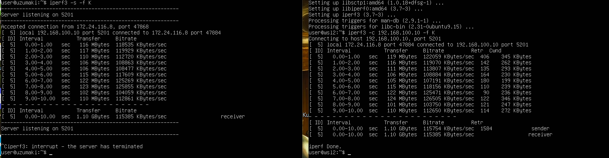
           
## Part 4. Сетевой экран

#### 4.1. Утилита **iptables**
##### Создай файл */etc/firewall.sh*, имитирующий фаерволл, на ws1 и ws2:

##### Нужно добавить в файл подряд следующие правила:
##### 1) На ws1 примени стратегию, когда в начале пишется запрещающее правило, а в конце пишется разрешающее правило (это касается пунктов 4 и 5).
##### 2) На ws2 примени стратегию, когда в начале пишется разрешающее правило, а в конце пишется запрещающее правило (это касается пунктов 4 и 5).
##### 3) Открой на машинах доступ для порта 22 (ssh) и порта 80 (http).
##### 4) Запрети *echo reply* (машина не должна «пинговаться», т.е. должна быть блокировка на OUTPUT).
##### 5) Разреши *echo reply* (машина должна «пинговаться»).

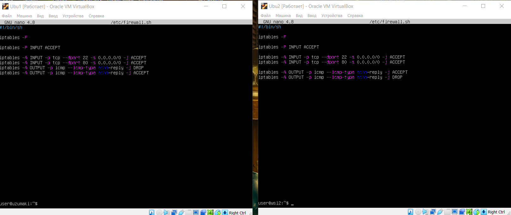

##### Запусти файлы на обеих машинах командами `chmod +x /etc/firewall.sh` и `/etc/firewall.sh`.

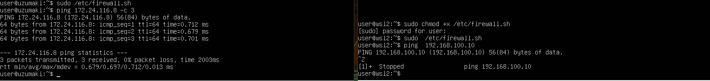

При прохождении пакета по цепочкам, будет проверяться его соответствие правилам, указанным в цепочке, если пакет попадает под правило, то будет выполнено цель указанная в этом правиле, если не попадает, то пакет перейдет к следующему правилу, порядок прохождения правил строго сверху вниз.

Разница в стратегиях - запрещающее правило не переписывается следующим за ним разрешающим.

#### 4.2. Утилита **nmap**
##### Командой **ping** найди машину, которая не «пингуется», после чего утилитой **nmap** покажи, что хост машины запущен.

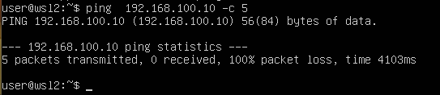

Проверка: в выводе nmap должно быть сказано: Host is up

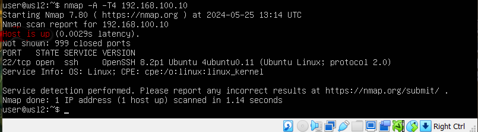

##### Сохрани дампы образов виртуальных машин


## Part 5. Статическая маршрутизация сети

##### Подними пять виртуальных машин (3 рабочие станции (ws11, ws21, ws22) и 2 роутера (r1, r2)).

ws11

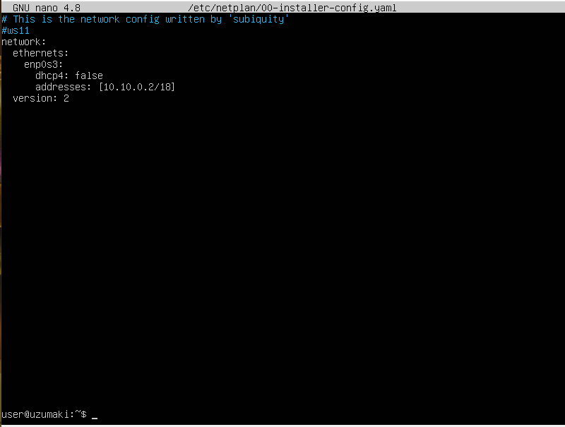
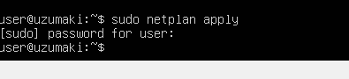

ws21

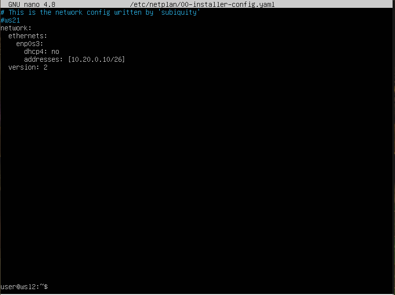
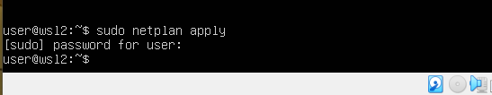

ws22

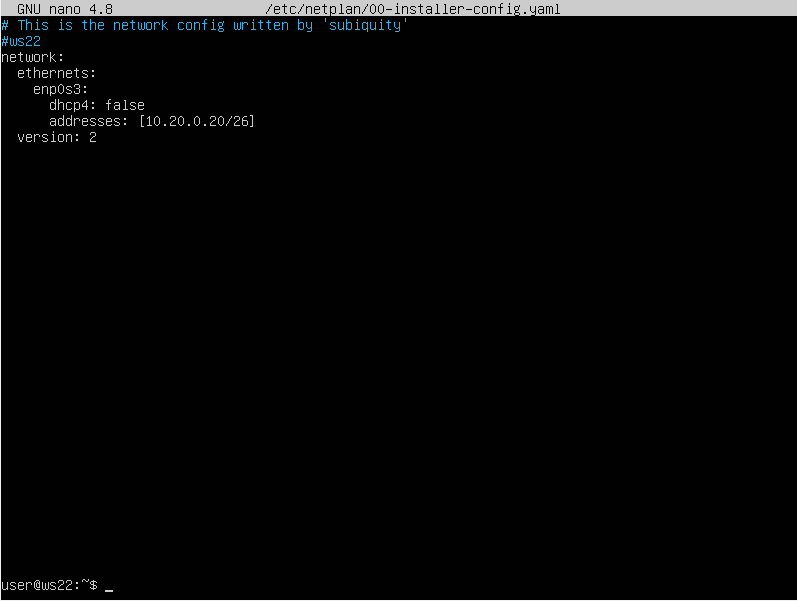


r1

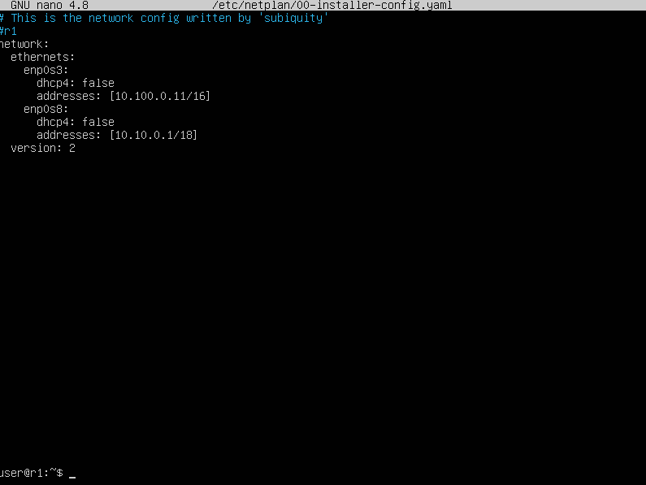
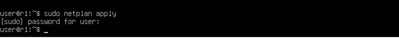

r2

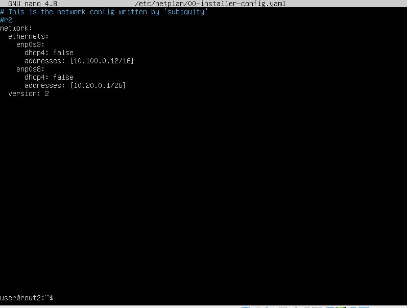


#### 5.2. Включение переадресации IP-адресов
##### Для включения переадресации IP, выполни команду на роутерах:
`sysctl -w net.ipv4.ip_forward=1`
*При таком подходе переадресация не будет работать после перезагрузки системы.*

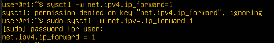
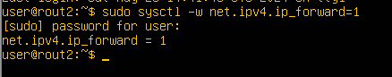

##### Открой файл */etc/sysctl.conf* и добавь в него следующую строку:
`net.ipv4.ip_forward = 1`
*При использовании этого подхода, IP-переадресация включена на постоянной основе.*

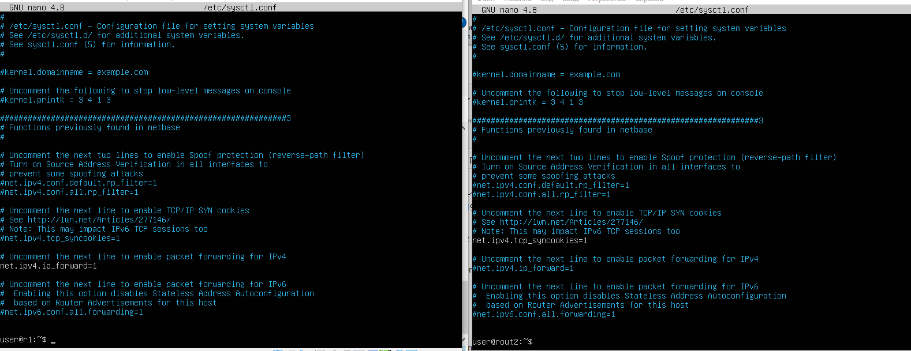

#### 5.3. Установка маршрута по-умолчанию
Пример вывода команды `ip r` после добавления шлюза:
```
default via 10.10.0.1 dev eth0
10.10.0.0/18 dev eth0 proto kernel scope link src 10.10.0.2
```
##### Настрой маршрут по-умолчанию (шлюз) для рабочих станций.

ws11

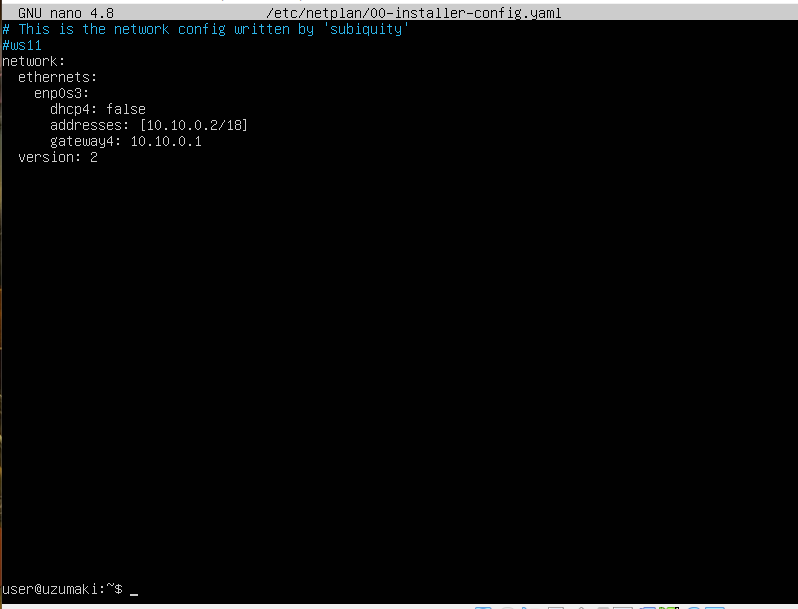

ws21

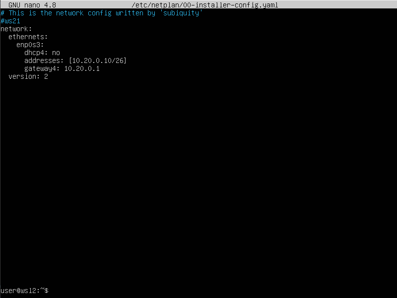

ws22


##### Вызови `ip r` и покажи, что добавился маршрут в таблицу маршрутизации.

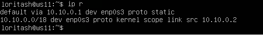
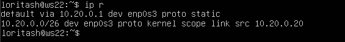


##### Пропингуй с ws11 роутер r2 и покажи на r2, что пинг доходит. Для этого используй команду:
`tcpdump -tn -i eth0`


#### 5.4. Добавление статических маршрутов
##### Добавь в роутеры r1 и r2 статические маршруты в файле конфигураций. Пример для r1 маршрута в сетку 10.20.0.0/26:
```shell
# Добавь в конец описания сетевого интерфейса eth1:
- to: 10.20.0.0
  via: 10.100.0.12
```


##### Вызови `ip r` и покажи таблицы с маршрутами на обоих роутерах.


##### Запусти команды на ws11:
`ip r list 10.10.0.0/[маска сети]` и `ip r list 0.0.0.0/0`


- Отправка в сеть пакетов с машины ws11 будет через enp0s3 напрямую получателю. При отправке пакетов вне сети 10.10.0.0/18, пакеты будут отправляться на интерфейс шлюза.

#### 5.5. Построение списка маршрутизаторов
##### Запусти на r1 команду дампа:
`tcpdump -tnv -i eth0`
##### При помощи утилиты **traceroute** построй список маршрутизаторов на пути от ws11 до ws21.


 Для определения промежуточных маршрутизаторов traceroute отправляет целевому узлу серию ICMP-пакетов (по умолчанию 3 пакета), с каждым шагом увеличивая значение поля TTL («время жизни») на 1. Это поле обычно указывает максимальное количество маршрутизаторов, которое может быть пройдено пакетом. Первая серия пакетов отправляется с TTL, равным 1, и поэтому первый же маршрутизатор возвращает обратно ICMP-сообщение «time exceeded in transit», указывающее на невозможность доставки данных. Traceroute фиксирует адрес маршрутизатора, а также время между отправкой пакета и получением ответа (эти сведения выводятся на монитор компьютера). Затем traceroute повторяет отправку серии пакетов, но уже с TTL, равным 2, что заставляет первый маршрутизатор уменьшить TTL пакетов на единицу и направить их ко второму маршрутизатору. Второй маршрутизатор, получив пакеты с TTL=1, так же возвращает «time exceeded in transit».
        - Процесс повторяется до тех пор, пока пакет не достигнет целевого узла. При получении ответа от этого узла процесс трассировки считается завершённым.
        - На оконечном хосте IP-датаграмма с TTL = 1 не отбрасывается и не вызывает ICMP-сообщения типа срок истёк, а должна быть отдана приложению. Достижение пункта назначения определяется следующим образом: отсылаемые traceroute датаграммы содержат UDP-пакет с заведомо неиспользуемым номером порта на адресуемом хосте. Номер порта будет равен 33434 + (максимальное количество транзитных участков до узла) — 1. В пункте назначения UDP-модуль, получая подобные датаграммы, возвращает ICMP-сообщения об ошибке «порт недоступен». Таким образом, чтобы узнать о завершении работы, программе traceroute достаточно обнаружить, что поступило ICMP-сообщение об ошибке этого типа.

#### 5.6. Использование протокола **ICMP** при маршрутизации
##### Запусти на r1 перехват сетевого трафика, проходящего через eth0 с помощью команды:
`tcpdump -n -i eth0 icmp`
##### Пропингуй с ws11 несуществующий IP (например, *10.30.0.111*) с помощью команды:
`ping -c 1 10.30.0.111`


## Part 6. Динамическая настройка IP с помощью **DHCP**
##### Для r2 настрой в файле */etc/dhcp/dhcpd.conf* конфигурацию службы **DHCP**:
##### 1) Укажи адрес маршрутизатора по-умолчанию, DNS-сервер и адрес внутренней сети. Пример файла для r2:
```shell
subnet 10.100.0.0 netmask 255.255.0.0 {}

subnet 10.20.0.0 netmask 255.255.255.192
{
    range 10.20.0.2 10.20.0.50;
    option routers 10.20.0.1;
    option domain-name-servers 10.20.0.1;
}
```
##### 2) В файле *resolv.conf* пропиши `nameserver 8.8.8.8`.


##### Перезагрузи службу **DHCP** командой `systemctl restart isc-dhcp-server`. Машину ws21 перезагрузи при помощи `reboot` и через `ip a` покажи, что она получила адрес. Также пропингуй ws22 с ws21.


##### Укажи MAC адрес у ws11, для этого в *etc/netplan/00-installer-config.yaml* надо добавить строки: `macaddress: 10:10:10:10:10:BA`, `dhcp4: true`.


##### Для r1 настрой аналогично r2, но сделай выдачу адресов с жесткой привязкой к MAC-адресу (ws11). Проведи аналогичные тесты.


##### Запроси с ws21 обновление ip адреса.


- Использованные опции: Список шлюзов IP адресов по умолчанию, имя DNS сервера по умолчанию, имя хоста клиента, маска подсети, шлюз по умолчанию. 


## Part 7. **NAT**

##### В файле */etc/apache2/ports.conf* на ws22 и r1 измени строку `Listen 80` на `Listen 0.0.0.0:80`, то есть сделай сервер Apache2 общедоступным.

ws22


r2


##### Запусти веб-сервер Apache командой `service apache2 start` на ws22 и r1.

ws22


r1


##### Добавь в фаервол, созданный по аналогии с фаерволом из Части 4, на r2 следующие правила:
##### 1) Удаление правил в таблице filter - `iptables -F`;
##### 2) Удаление правил в таблице "NAT" - `iptables -F -t nat`;
##### 3) Отбрасывать все маршрутизируемые пакеты - `iptables --policy FORWARD DROP`.
##### Запусти файл также, как в Части 4.
##### Проверь соединение между ws22 и r1 командой `ping`.


##### Добавь в файл ещё одно правило:
##### 4) Разрешить маршрутизацию всех пакетов протокола **ICMP**.
##### Запусти файл также, как в Части 4.
##### Проверь соединение между ws22 и r1 командой `ping`.


